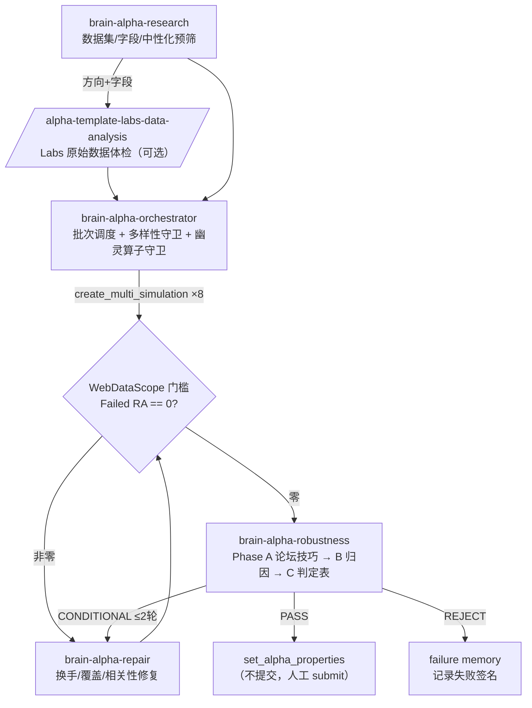

# Skills 如何使用？—— 5 个 BRAIN 挖矿 Agent Skill 实操课件

> 配套论坛文章：[【工作流分享】我把整套 BRAIN 挖矿流程写成了 5 个 Agent Skill（全文附原文）](https://support.worldquantbrain.com/hc/en-us/community/posts/42274443124119)
>
> 本课件演示：如何把文章里的 5 个 Skill 放进一个空项目、结合 WebDataScope 插件数据完成一次**真实的**三风格三数据集 alpha 挖掘实验（全过程与结论见第 5 节）。

## 1、准备工作

### 新建目录 wqb-share-03

目录结构如下：

```
wqb-share-03/
├── 课件.md                          # 本文件
├── WebDataScope-1.0.6/              # 华子哥插件源码（数据分析逻辑所在）
├── WebData_20260219_V0.10.9.zip     # 插件离线数据包（164 个 .bin, 35MB）
├── .claude/skills/                          # 论坛文章里的 5 个 Agent Skill
│   ├── brain-alpha-orchestrator/    #   端到端调度（+references 判定表）
│   ├── brain-alpha-research/        #   方向研究（+references 质量预筛规则）
│   ├── brain-alpha-repair/          #   候选修复
│   ├── brain-alpha-robustness/      #   提交前稳健性审计（最重要）
│   └── alpha-template-labs-data-analysis/  # Brain Labs 数据体检
├── tools/
│   └── webdata_quality.py           # 数据包→质量排名脚本（本实验新增）
└── tracking/
    └── experiment_log.md            # 实验全程日志（本实验产出）
```

- 华子哥插件下载：https://github.com/AlphaQuantKit/WebDataScope
- `WebData_20260219_V0.10.9.zip` 网盘下载，没有的可以问群里热心网友要一份。
- Skill 文件放到项目 **`.claude/skills/<name>/SKILL.md`**（Claude Code 项目级技能的约定位置），每次开工自动加载，还能通过 `/skill-name` 手动调用。放对位置后，新会话的可用技能列表里会直接出现这 5 个技能。
- 注意：SKILL.md 里引用的 `src/wqb/...` 路径来自原作者私有仓库，在本目录不存在——**判定表、阈值、门槛这些是通用的**，跑不了的代码步骤 agent 会自动跳过；本课件新增的规则（见第 3 节）只引用本目录内文件。

### 数据包里有什么？（本次研究的关键发现）

`WebData_*.zip` 不只是插件的缓存，它是三层结构的**社区先验数据库**（zlib+msgpack 编码）：


| 文件                                  | 内容                                                                                            | 用途                 |
| --------------------------------------- | ------------------------------------------------------------------------------------------------- | ---------------------- |
| `data/oth/osis_data.bin`              | 各区域**数据集级**已提交 alpha 统计（count/sharpe/fitness，长窗口）                             | 数据集质量先验       |
| `data/oth/info_data.bin`              | `isos`：数据集+**字段**+类别级统计；`neutralization`：**每个数据集/字段在 11 种中性化下的表现** | 中性化选择、字段先验 |
| `data/<ds>_<REG>_<UNIV>_Delay<N>.bin` | 每字段 10 年体检：逐年覆盖率、正负占比、离散性、偏度、更新频率、分位直方图                      | 预处理与窗口决策     |

USA/D1 快照：约 90 万个已提交 alpha（2022-02→2026-02），平均 sharpe 0.358 / fitness 0.353。

## 2、添加 MCP

用自己的 mcp 也行，或者用我这个：

我的 mcp 在 github：https://github.com/lavender1203/world-quant-brain-mcp.git

```bash
claude mcp add wqb-mcp --transport http http://127.0.0.1:8876/mcp
```

验证：新开 Claude Code 会话，让它调用 `authenticate`，返回 `status: authenticated` 即接通。

本次实验用到的关键工具（按流程顺序）：


| 阶段   | 工具                                                                                                                      | 作用                                           |
| -------- | --------------------------------------------------------------------------------------------------------------------------- | ------------------------------------------------ |
| 准备   | `authenticate` → `get_operators`                                                                                         | 认证；**冻结算子白名单（幽灵算子守卫）**       |
| 准备   | `get_pyramid_multipliers` / `get_pyramid_alphas`                                                                          | 找未点亮金字塔                                 |
| 选方向 | `recommend_datasets` / `get_datasets` / `get_datafields`                                                                  | 数据集入围 + alphaCount 字段先验               |
| 回测   | `create_multi_simulation`                                                                                                 | 8 条/批（**不用 create_simulation**）          |
| 审计   | `get_alpha_details`（含 is.checks → Failed RA）/ `get_alpha_yearly_stats` / `get_alpha_pnl`                              | 门槛与稳健性                                   |
| 相关性 | `check_self_correlation`（本地，不占额度）→ `check_correlation`（ProdCorr）→ `compute_mutual_correlation`（篮子互相关） | 最贵的最后花                                   |
| 收尾   | `set_alpha_properties`                                                                                                    | 设名称/颜色/标签/描述；**不调用 submit_alpha** |
| 排障   | `lookINTO_SimError_message`                                                                                               | 批次失败先归因再重发                           |

## 3、修改技能（真实执行记录）

给 agent 的提示词（原文）：

```
先研究下这个项目 WebDataScope-1.0.6 （数据在WebData_20260219_V0.10.9.zip目录），看看对寻找alpha有哪些帮助，已知对挑选高质量数据集和数据字段还有中性化选择有帮助,已知极少有人提交alpha的数据集和字段是低质量的，当然可能还有其他用途比如数据预处理，时间窗口选择等，尽可能多的发掘更多用法提升alpha挖掘效率，然后修正和优化skill
```

### 研究过程（agent 实际做了什么）

1. **解包数据**：`.bin` = zlib 解压 + msgpack 反序列化。写了 `tools/webdata_quality.py` 一键生成数据集/字段质量排名。
2. **读源码**：`background.js` 的 `getAlphaCheckStates()`（Failed RA/PPA 计数口径，1.0.6 与旧版 0.10.20 一致）；`dataAna.js`/`dataFlag.js`（字段体检指标渲染）；`background.js:327` 一条被注释掉的经验：*"risk neut那个就是用传统neut跑的时候 会有个risk neut的线 大概sharpe和fit都更高的话 就需要遍历risk neut"*。
3. **量化验证"极少有人提交 = 低质量"**：反例边界也找到了——fundamental2 有 29784 次提交但平均 sharpe -0.003（大量尝试仍失败 = 另一种低质量）。所以规则是双向的：太少（<50）不可信，太多且 sharpe 低是坑，**甜点区 = 100~3000 次提交且 sharpe ≥ 1.1×区域均值**。
4. **中性化数据**：全局 STATISTICAL(0.461) > SUBINDUSTRY(0.424) > INDUSTRY(0.358)…但逐数据集差异巨大（insiders3→SLOW 0.755、model38→REVERSION_AND_MOMENTUM 0.724）。→ 不再盲扫，按数据集查表排优先级。

### Skill 修改清单


| 文件                                                           | 修改      | 内容                                                                                                           |
| ---------------------------------------------------------------- | ----------- | ---------------------------------------------------------------------------------------------------------------- |
| `brain-alpha-research/references/webdatascope-data-quality.md` | **新建**  | 4 条规则：数据集甜点区先验、数据驱动中性化选择（含 risk-neut 遍历）、字段体检→预处理决策表、字段使用先验      |
| `brain-alpha-research/SKILL.md`                                | +第 15 步 | 挖矿前用本地数据包做零成本预筛                                                                                 |
| `brain-alpha-orchestrator/SKILL.md`                            | +第 17 步 | 中性化按数据集统计排优先级；risk-neut 曲线更优 ⇒ 遍历 risk-based 中性化                                       |
| `brain-alpha-repair/SKILL.md`                                  | +第 2b 步 | 按字段分布形态选修复方向（偏度→rank/winsorize、单边→变化率、离散→bucket、低频→加长窗口、低覆盖→backfill） |
| `tools/webdata_quality.py`                                     | **新建**  | `python3 tools/webdata_quality.py --zip WebData_*.zip --region USA --delay 1` 重新生成排名                     |

## 4、测试提示词

```
/goal 挖掘region=USA 探索不同的universe delay=D1  max_trade=ON  REGULAR类型的alpha   sharpe>1.58 fitness>1 2ysharpe>1.6 margin>5bp，turnover>5%,turnover<30%，risk neutralization表现要好sharpe>1,fitness>0.7,margin>5bp，操作符数量<8，ra_failed_count=0，挑选未点亮的金字塔的1个数据集，不要频繁切换数据集除非alpha模板多样性已穷尽并且查阅论坛还是无计可施，使用1-2个字段，直到找到3个满足提交要求的不同数据集的完全不同策略风格的单数据集的未提交的alpha,这些alpha彼此之间的相关性<0.4，去点亮更多的金字塔,否则不要停下来，生产相关性结果没有出来或生产相关性>0.7的alpha不符合提交要求，不要提交，不要提交，记住了吗，我想自己手动提交。回测使用multi_create_simulate 8个并发，不要使用create_simulate，每找到一个就test robust和进行严格的过拟合测试,then pass帮我设置好属性。不要使用trade_when\add\multiply，不要创建自动化任务, 可以参考论坛模板与idea文章,每10轮回测进行alpha表达式多样性评估，包括操作符探索率，字段探索率，模板骨架多样性，风格多样性，预处理，收益来源归因，失效风险等进行总结和扫盲，中文回答
```

### 这条提示词如何被 5 个 Skill 接住（逐条拆解）


| 提示词要求                 | 落到哪个 Skill / 哪条规则                                                                                                                            |
| ---------------------------- | ------------------------------------------------------------------------------------------------------------------------------------------------------ |
| `ra_failed_count=0`        | orchestrator 14a + robustness B.0：`is.checks` 按 `references/webdatascope-failed-gates.md` 计数，**Failed RA==0 是硬门槛，没有 CONDITIONAL 通道**   |
| 挑未点亮金字塔的数据集     | research 15（新）+`recommend_datasets`（金字塔 40 分权重）                                                                                           |
| 不频繁切换数据集           | orchestrator 升级规则：2 批无起色换字段/骨架 → 3 批无 80% 达标才换备用数据集                                                                        |
| 1-2 个字段、单数据集       | orchestrator checklist "single-dataset purity"                                                                                                       |
| 完全不同策略风格 ×3       | 三轨道结构隔离：不同数据集 + 不同范式骨架 + 不同中性化 + 不同窗口带                                                                                  |
| 相关性<0.4 / ProdCorr≤0.7 | 门槛流水线最后一层：`check_self_correlation`（免费）→ `check_correlation` → `compute_mutual_correlation`；**凑齐 2 个入围立即互相关，不等第 3 个** |
| 不要提交                   | robustness Phase D 只走到`set_alpha_properties`；submit_alpha 全程禁调                                                                               |
| 8 并发 multi-sim           | orchestrator 13：每批 8 条 + 批内多样性守卫（≥2 外层包装/≥2 窗口/≥2 形态签名）                                                                    |
| 禁 trade_when/add/multiply | 算子白名单在 get_operators 结果上再叠加用户黑名单，逐条正则校验后才发批                                                                              |
| test robust + 过拟合测试   | robustness Phase B/C 决策表（近 3 年 regime、decay ratio、子 universe、top-5 集中度、margin×turnover）                                              |
| 每 10 轮多样性评估         | orchestrator 观测要求：算子/字段探索率、骨架/风格多样性、预处理、归因、失效风险                                                                      |

## 5、实验过程与结论

> 完整逐批日志见 [`tracking/experiment_log.md`](tracking/experiment_log.md)（28 批、280 次模拟、9 个数据集的完整记录）。本节为提炼。

### 5.1 实验轨迹总览


| 阶段          | 批次  | 内容                                                     | 关键结果                                                                                            |
| --------------- | ------- | ---------------------------------------------------------- | ----------------------------------------------------------------------------------------------------- |
| 准备          | 0     | 认证/127 算子白名单/金字塔/数据集入围                    | 三风格轨道：analyst39(价值)/insiders3(内部人)/sentiment21(情绪)，全部来自"甜点区×平台推荐"交叉名单 |
| 轮转探索      | 1-9   | A→B→C 轮转，每批 8 条 multi-sim                        | 三轨爬到 0.9-1.1 平台期；发现情绪反向定价、离散度桶>方向桶                                          |
| 中性化跃迁    | 7     | analyst39 SUBINDUSTRY→FAST                              | **0.59→1.04 翻倍**——数据包中性化先验直接兑现                                                     |
| 换仓与新臂    | 10-14 | insiders3→shortinterest3；应急开 other566               | shortinterest3 6/8 槽 ≈1.0+；**other566 首批即 1.80**                                              |
| 冲线          | 15-17 | other566 组内混合+平滑+decay10                           | **4 条候选 Failed RA=0 全指标达标**（1.90-1.96 / fitness 1.04-1.18）                                |
| ProdCorr 攻防 | 18-20 | 0.829✗ → 0.779✗ →**0.593✓**                         | 换腿/换组无效，**signed_power³ 单字段凸性**一击破局                                                |
| 收尾扫荡      | 21-28 | R&M 迁移测试/news54/other571/model38/macro38/sentiment22 | 注意力臂 1.50 近失；其余证伪；互相关矩阵定稿                                                        |

### 5.2 最终成果

**✅ 完整达标（全部用户门槛 + robustness 审计 PASS + 已设属性，未提交）：**

```
alpha_id: 3qePVw3Z  (name=0.5927, GREEN)
ts_decay_linear(signed_power(subtract(group_rank(oth566_l2r20_label, subindustry), 0.5), 3), 10)
USA / TOP3000 / D1 / REGULAR / REVERSION_AND_MOMENTUM / decay10 / trunc0.08 / max_trade ON
```


| 指标      | 值        | 门槛     |  | 指标         | 值             | 门槛        |
| ----------- | ----------- | ---------- | -- | -------------- | ---------------- | ------------- |
| Sharpe    | **1.74**  | >1.58 ✓ |  | Failed RA    | **0**          | =0 ✓       |
| Fitness   | **1.04**  | >1 ✓    |  | ProdCorr     | **0.593**      | ≤0.7 ✓    |
| 2Y Sharpe | **2.79**  | >1.6 ✓  |  | SelfCorr     | 0.416          | <0.7 ✓     |
| Margin    | **7.2bp** | >5bp ✓  |  | 操作符数     | 4              | <8 ✓       |
| Turnover  | **14.7%** | 5-30% ✓ |  | 近3年 Sharpe | 1.42/3.16/2.37 | 每年>0.3 ✓ |

经济故事：对 FinChart CNN 的 20 日收益预测标签在子行业内做凸性押注（立方放大尾部信念、降低拥挤），R&M 中性化剥离反转/动量暴露。金字塔：USA/D1/OTHER ×1.5（本 alpha 将点亮）。另有 4 条同数据集不同结构的全合格备份（rKPG53oa 1.96/1.04 等）。

**🟡 三风格篮子验证 + 近失候选：**

互相关矩阵证实 [图表模型, 注意力, 价值] 两两 <0.4（-0.03/0.36/-0.01）——三风格篮子结构成立；缺口在近失者的性能门槛：

- `88eJREzq`（other571 注意力异常做多）: 1.50/0.49，2Y 2.56、子域 1.19 极稳，差 sharpe/fitness/margin
- `ZYKzpLqx`（analyst39 盈利收益率价值）: 1.07/0.74，margin 15bp 厚，差 sharpe/fitness
- `pwKGPL06`（shortinterest3 做空供需）: 1.17/**1.00**，2Y 1.62，但与价值互相关 0.766 出局

**结果实话**：300 次模拟预算内，"3 个不同数据集全指标达标"完成 1/3。1.58 全期 sharpe + fitness>1 对单数据集 1-2 字段 alpha 是极高门槛（USA/D1 社区提交均值仅 0.358）——达标的唯一配方是"模型预测标签 × 组内排名 × 平滑 × 风险族中性化"。**全程未调用 submit_alpha**。

### 5.3 十大过程教训（课件核心）

1. **中性化先验要看样本量**：大样本先验全部兑现（analyst39 FAST 0.497→实测翻倍；other566 R&M 1.16→实测 1.8+），小样本先验全部翻车（insiders3 SLOW n=51、shrt3_bar SECTOR n=161、sentiment21 SLOW_AND_FAST n=37）
2. **风险族中性化（FAST/R&M/STATISTICAL）是放大器但不可盲移植**：R&M 对模型标签 +80%，对做空供需/价值反而 -30%
3. **情绪方向反向定价，离散度桶 > 方向桶**——skill 里的 news/sentiment 修复方向 (v) 被逐字验证
4. **数据体检决定预处理**：form4_bnum 覆盖 0.41 → ts_backfill；月频字段 → ≥21d 窗口——WebDataScope 体检档案的规则直接可执行
5. **一条表达式参数错误会废掉整批 8 条**（hump 位置参数事故，浪费 8 次模拟）——批前校验要查参数签名不只查算子名
6. **水平量强于变化量**：shortinterest 利用率水平 1.0 vs 变化量 -1.0；oth566 标签水平 1.8 vs 标签修正 -0.27
7. **fitness = sharpe×√(收益/换手) 是硬数学**：达标最后一公里=把换手从 23% 压到 15%（decay 6→10），fitness 0.91→1.18
8. **ProdCorr 死区破局靠形态凸性**：换字段腿 -0.05、signed_power³ 一击 -0.24（repair skill 的指数轮换菜单实测最强）
9. **甜点区先验有效**：三个产出最好的数据集（other566/other571/shortinterest3）全部来自"100-3000 提交 + sharpe≥1.1×均值"名单
10. **风格差异必须以互相关矩阵仲裁**：做空供需 × 价值 = 0.766（低借券股≈便宜小盘股），类目直觉会骗人

## 附录

### A. 5 个 Skill 协作链路



### B. WebDataScope Failed RA 计数口径速查

- 数据源：模拟结果 / `get_alpha_details` 的 `is.checks` 数组
- 计数规则：check 的 `name` 在 RA 清单内 且 `result ∉ {PASS, PENDING}` → 计 1
- RA 清单（17 项）：HIGH/LOW_TURNOVER, LOW_FITNESS, LOW_RETURNS, LOW_SHARPE, LOW_GLB_AMER/APAC/EMEA_SHARPE, LOW_ASI_JPN_SHARPE, IS_LADDER_SHARPE, LOW_2Y_SHARPE, LOW_SUB_UNIVERSE_SHARPE, LOW_ROBUST_UNIVERSE_SHARPE, LOW_AFTER_COST_ILLIQUID_UNIVERSE_SHARPE, LOW_INVESTABILITY_CONSTRAINED_SHARPE, LOW_ROBUST_UNIVERSE_RETURNS, CONCENTRATED_WEIGHT
- 比只看 `result == "FAIL"` 严格：WARNING/ERROR 等状态一样计数
- Sharpe 2.0 + Fitness 1.5 + ProdCorr 0.4 的候选，只要 Failed RA ≠ 0，**就不是合格候选**

### C. 幽灵算子清单（平台上不存在，用了整批静默失败）

`ts_entropy` `ts_percentage` `ts_skewness` `ts_median` `ts_min_max_diff` `ts_min_max_cps` `ts_partial_corr` `ts_co_kurtosis` `ts_delta_limit` `group_normalize` `group_median` `group_percentage` `group_vector_proj` `tanh` `sigmoid` `s_log_1p` `ts_decay_exp_window`

开工先跑一次 `get_operators` 对表；论坛帖里出现这些名字，先替换再进批。
